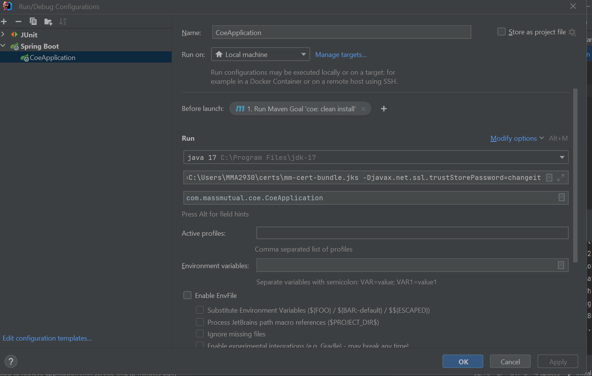

# coe-on-call-allowance-spring
Before you can get this project running locally you'll need a few things:

* Java JDK ([Version 17](https://jdk.java.net/java-se-ri/17) is required to work with the current build structure)
* Maven 3 ([Version 3.8.6](https://maven.apache.org/download.cgi) is what we use but later versions may be compatible)
* Editor or IDE ([JetBrains IntelliJ](https://www.jetbrains.com/idea/download/) is recommended)
* API Client (The latest version of [Postman](https://www.postman.com/) is recommended)

#### Step 1: Setting up your environment
##### IntelliJ

* clone the project from https://github.com/massmutual/coe-on-call-allowance-spring using git clone command.
* open in IDE as new project.
* set up your project in IDE as per below image.

